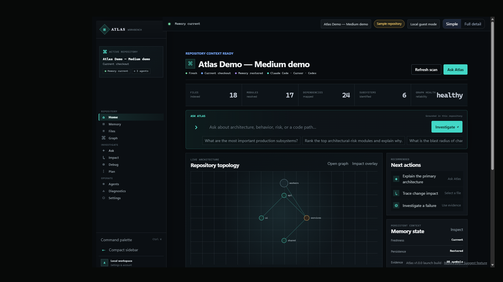
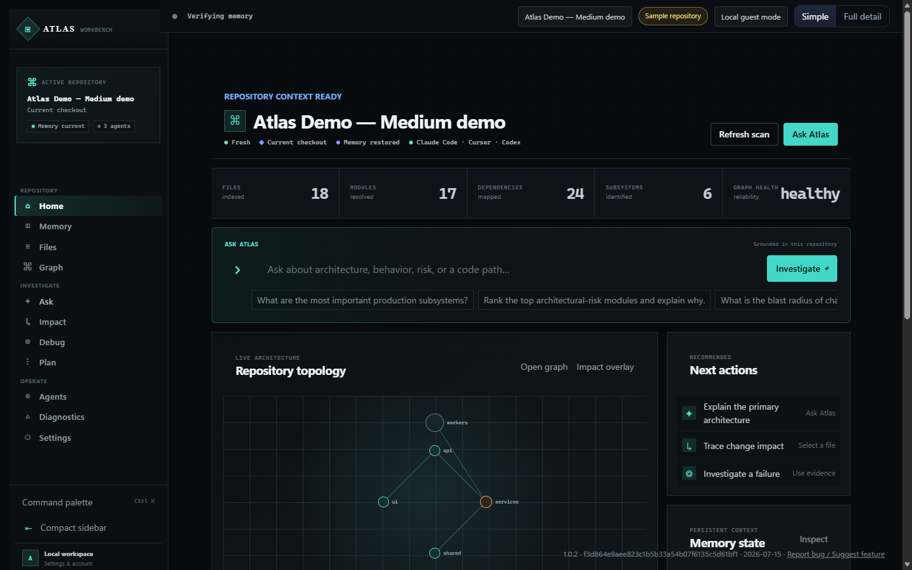
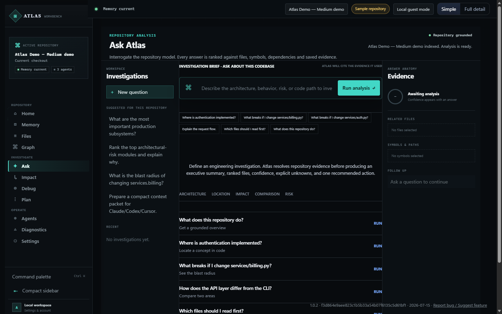
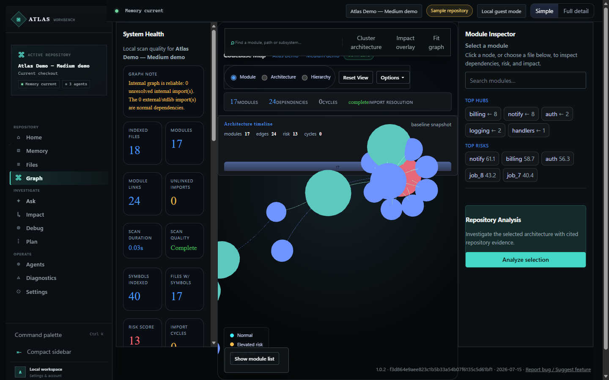
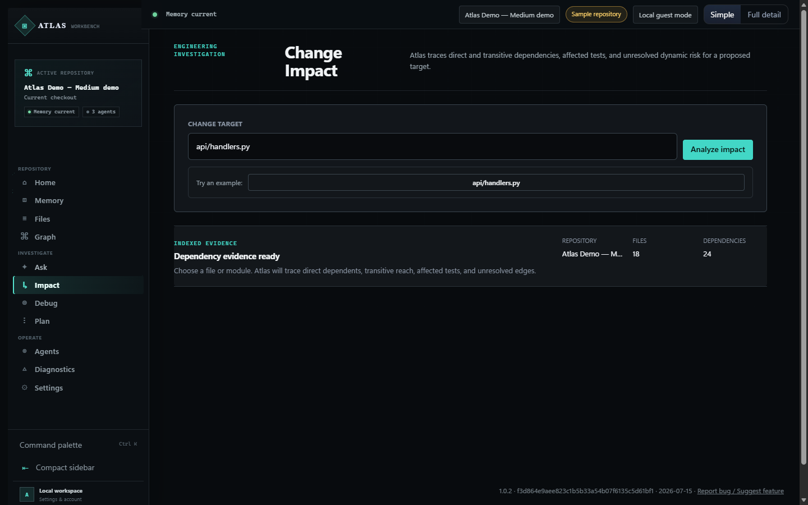
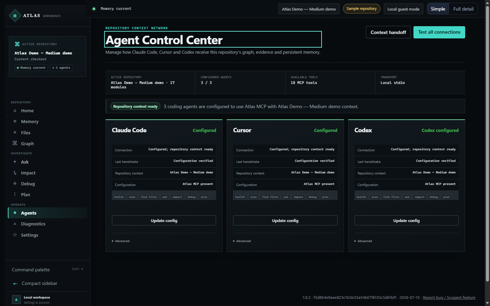
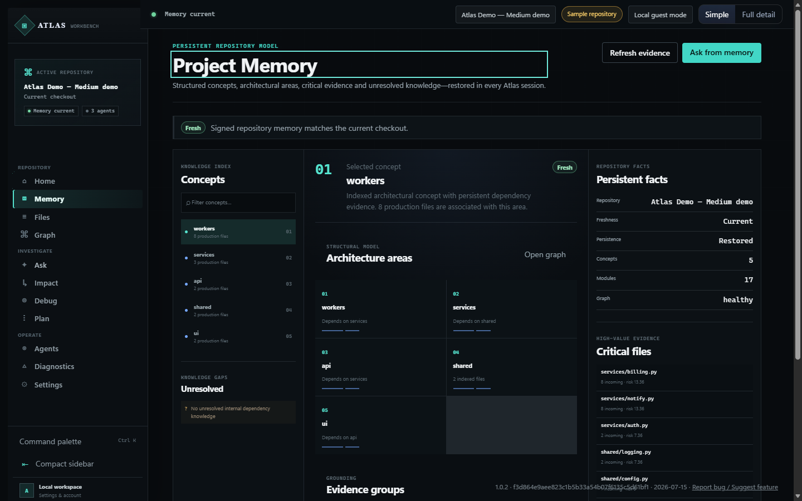

# Atlas

**Know what breaks before your AI changes it.**

Atlas is a local, agent-agnostic code-context engine for AI coding agents. It parses your
repository into a dependency graph and symbol index, then gives Claude Code, Cursor, Codex,
and any MCP-compatible agent the exact files, symbols, and blast radius needed for a task.

**Website:** https://atlas-repo-wu76.vercel.app  
**Download (Windows v1.0.3):** https://atlas-repo-wu76.vercel.app/download/atlas  
**Status:** **1.0.3, Windows only** — proprietary, source-visible on GitHub.

## 30-second workflow

1. Install `Atlas_Setup.exe` (unsigned — verify SHA-256 on the [download page](https://atlas-repo-wu76.vercel.app/download)).
2. Continue locally without an account (or sign in later).
3. Load the bundled **Atlas Demo** repository or scan your own project.
4. Ask a grounded question — e.g. *Where is authentication implemented?*
5. Connect Claude Code, Cursor, or Codex via one-click MCP config (timestamped backup).

Your code stays on your machine. Indexing is local; MCP runs over stdio. Nothing is uploaded
to an Atlas indexing service.

---

## Why Atlas

On a large or unfamiliar codebase, an AI agent either burns context opening the wrong files,
or leans on a hand-maintained `CLAUDE.md` / `AGENTS.md` that drifts. Atlas gives the agent a
precise, continuously scanned map instead of a guess.

In an independent retrieval benchmark (gold = where a symbol is actually defined, resolved by
grep, independent of Atlas; 62 tasks across 11 repos):

| Metric | Atlas | Baseline |
|---|---:|---:|
| Hit@1 | **0.55** | 0.27–0.32 keyword / BM25 |
| MRR | **0.68** | — |
| Recall@5 | **0.77** | — |
| Fabricated files | **0** | — |

Honest scope: this measures **retrieval quality**, not end-to-end task outcomes. See
[Differentiation](docs/DIFFERENTIATION.md).

---

## Product tour

### Home — repository overview

At-a-glance metrics (files, modules, edges, subsystems) with graph health and suggested next actions.

### Ask Atlas — grounded answers with evidence

Deterministic lookups against the local index — cited file paths, not hallucinated summaries.

### Dependency graph

Interactive module/subsystem graph built from resolved imports.

### Impact analysis

Static import-graph impact: direct and transitive dependents with cited evidence.

### Agents / MCP

Configure Claude Code, Cursor, and Codex with backed-up MCP entries — **Configured**, not falsely “Connected”.

### Memory

Persisted repository memory with freshness and trust status validated against the live checkout.

---

## What it does

| Capability | Tool |
|---|---|
| Scan a repo into a dependency graph + symbol index | `atlas_scan_repo` |
| Compact, evidence-ranked context pack | `atlas_build_context_pack` |
| Rank task-relevant files with reasons + confidence | `atlas_find_relevant_files` |
| Impact analysis — “what breaks if I change X” | `atlas_what_breaks` |
| Root-cause analysis from stack traces | `atlas_root_cause` |
| Repo summary, architecture, graph, health | `atlas_repo_summary`, … |
| Export context for Claude / Cursor / Codex | `atlas_export_for_*` |

Full tool list: [README_MCP.md](README_MCP.md) (18 tools). Client proof: [docs/MCP_CLIENT_PROOF.md](docs/MCP_CLIENT_PROOF.md).

---

## Install (Windows)

1. Download from https://atlas-repo-wu76.vercel.app/download/atlas  
   **SHA-256:** `93AAC567999B0E3D0AAA30AA6E4FBFC9DCFF605DD35DC1D0E1523F4D066B5649`
2. Run the installer. It is **not code-signed** — SmartScreen may warn until signing is complete.
3. Launch Atlas → **Continue without an account** → load demo or scan your repo.
4. Connect your agent — [docs/MCP_CLIENT_SETUP.md](docs/MCP_CLIENT_SETUP.md).

---

## Current limitations (honest)

- **Windows only** — macOS/Linux are not supported yet.
- **Unsigned installer** — verify SHA-256 before running.
- Deep graph analysis: **Python + JS/TS**; other languages are file-level.
- Impact analysis sees **static imports only** — dynamic dispatch is invisible.
- **Payments / Pro checkout** disabled until billing is verified end-to-end.
- End-to-end agent task improvement has **not** been measured separately from retrieval.

---

## Documentation

- [README_MCP.md](README_MCP.md) · [docs/MCP_CLIENT_SETUP.md](docs/MCP_CLIENT_SETUP.md)
- [docs/LOCAL_FIRST.md](docs/LOCAL_FIRST.md) · [docs/DIFFERENTIATION.md](docs/DIFFERENTIATION.md)
- [SECURITY.md](SECURITY.md) · [PRIVACY.md](PRIVACY.md) · [TERMS.md](TERMS.md)

## License

Proprietary. See [LICENSE](LICENSE).
