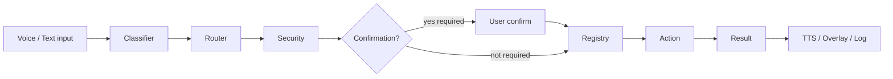

# local_jarvis — Architecture Map

This document describes the **current** `local_jarvis` system at `C:\J.A.R.V.I.S\local_jarvis`. It is documentation only; behavior is defined by code and `config.py`.

For setup and day-to-day usage, see [README.md](README.md).

---

## 1. Main pipeline

Every user command—typed, spoken (STT), or triggered after wake word—flows through the same secured path. UI layers (overlay, tray) **never** execute commands directly.



### Step-by-step

| Step | Module | Role |
|------|--------|------|
| **Input** | `main.py`, `voice/voice_loop.py`, `voice/wakeword_loop.py`, `ui/tray_app.py` | Text console, push-to-talk, wake word → temporary listen, or tray menu phrases |
| **Transcriber** | `voice/transcriber.py` | Speech → text (faster-whisper); output is plain text only |
| **Classifier** | `brain/intent_classifier.py`, `brain/llm_intent_classifier.py` (optional), `brain/english_voice_phrases.py`, `brain/aliases.py` | Maps phrase → `Intent` + `params` + confidence; rules first, optional Ollama JSON |
| **Router** | `brain/router.py` | Orchestrates confirm/alias/follow-up, security, confirmation, registry, history log |
| **Security** | `core/security.py` | Allowlisted intents, implemented check, block unknown/clarify |
| **Confirmation** | `core/confirmation.py`, `config.CONFIRMATION_REQUIRED_INTENTS` | Destructive/sensitive intents pause until yes/no |
| **Registry** | `actions/registry.py` | `Intent` → `BaseAction.execute()` |
| **Action** | `actions/*.py` + domain packages (`apps/`, `websites/`, etc.) | Single responsibility handlers; no LLM execution |
| **Result** | `core/types.py` (`CommandResult`), `core/results.py` | Structured status, summary, optional `data` |
| **Output** | `core/app.py`, `voice/tts.py`, `ui/overlay_app.py` | Rich console, optional TTS summary, overlay state (UI only) |
| **Log** | `brain/router.py` → `data/command_history.jsonl` | Every routed command logged (redacted fields) |

Entry point for all command execution from the app:

```text
JarvisApp.handle_text_command()  →  CommandRouter.route()
```

---

## 2. Folder map

```
local_jarvis/
├── main.py                 # CLI: --text, --tray, --voice, --wakeword, --speak, --overlay, …
├── config.py               # Allowlists, paths, feature flags (.env via python-dotenv)
├── requirements.txt
├── README.md
├── README_ARCHITECTURE.md  # This file
├── .env / .env.example
│
├── core/                   # Application kernel
│   ├── app.py              # JarvisApp — single handle_text_command() entry
│   ├── types.py            # Intent, CommandRequest, CommandResult, ActionStatus
│   ├── security.py         # Intent allowlist validation
│   ├── confirmation.py     # Pending confirm / yes / no
│   ├── session.py          # Follow-up context, pending confirmation id
│   ├── runtime_state.py    # Voice / speak / wake / overlay toggles (in-process)
│   ├── startup.py          # Smoke test, debug-startup banners, import probes
│   ├── results.py          # result_success / failed / blocked helpers
│   └── logger.py
│
├── brain/                  # Classification & routing (no execution)
│   ├── router.py           # CommandRouter — main pipeline
│   ├── intent_classifier.py# Rules + Hebrew/English phrases
│   ├── llm_intent_classifier.py  # Optional Ollama JSON classifier
│   ├── command_parser.py   # Params enrichment, follow-ups
│   ├── aliases.py          # User-defined phrase → intent
│   ├── memory.py / preferences.py / storage_safe.py
│   └── prompts.py          # LLM classification prompt (JSON only)
│
├── actions/                # Registered handlers (called only via registry)
│   ├── base.py             # BaseAction
│   ├── registry.py         # ActionRegistry — intent → action instance
│   ├── powershell.py       # Allowlisted .ps1 scripts only (shell=False)
│   ├── apps.py / filesystem.py / browser.py
│   ├── trading_*.py        # Dashboard, loops, logs, reports
│   ├── app_actions.py      # Safe Start Menu app launcher
│   ├── website_actions.py  # Allowlisted https sites (webbrowser.open)
│   ├── vision_actions.py / diagnostics_actions.py / workflow_actions.py
│   ├── memory_actions.py / computer_control_actions.py / service_actions.py
│   └── capabilities.py     # show_capabilities, list_skills (read-only)
│
├── voice/                    # Audio I/O (produces/consumes text only for routing)
│   ├── microphone.py
│   ├── transcriber.py      # faster-whisper STT
│   ├── voice_loop.py       # Push-to-talk loop
│   ├── wakeword.py / wakeword_loop.py / wake_greeting.py
│   └── tts.py              # pyttsx3 — speaks CommandResult.summary only
│
├── ui/                     # Display & tray (no command bypass)
│   ├── tray_app.py         # System tray, safe menu commands
│   ├── overlay_app.py      # PySide6 HUD state bridge
│   ├── overlay_hud.py      # Full-screen Iron Man HUD (QPainter)
│   ├── overlay_state.py / overlay_theme.py
│   ├── console_ui.py
│   └── notifications.py
│
├── apps/                   # Phase 15 — safe installed app launcher
│   ├── discovery.py        # Start Menu .lnk scan
│   ├── app_registry.py     # data/approved_apps.json
│   ├── launcher.py         # os.startfile(.lnk) only
│   └── safety.py           # Block cmd/powershell/System32/scripts
│
├── websites/               # Phase 16 — allowlisted browser URLs
│   ├── registry.py         # Built-in + approved sites
│   ├── launcher.py         # webbrowser.open() only
│   └── safety.py           # https-only, no localhost/IP abuse
│
├── workflows/              # Predefined multi-step sequences (code-defined)
│   ├── registry.py / runner.py
│   └── trading_workflows.py / system_workflows.py
│
├── diagnostics/            # Read-only cross-source analysis
│   ├── engine.py / collectors.py / models.py
│
├── memory/                 # Personal knowledge, project index, derived graph
│   ├── store.py / search.py / redaction.py / project_indexer.py / graph.py
│
├── conversation/           # Phase 37 — context store + suggestions (post-router only)
│   ├── context_store.py / suggestion_engine.py / response_enhancer.py
├── vision/                 # Read-only screen (VISION_* legacy + Phase 35 SCREEN_*)
│   ├── screen_capture.py / screen_ocr.py / screen_understanding.py
│   ├── screen_redaction.py / active_window.py / ocr.py / screen_analyzer.py
│   ├── window_info.py / redaction.py
│
├── computer_control/       # Predefined window/clipboard (optional, confirm)
│   ├── window_actions.py / clipboard_actions.py / safety.py
│
├── skills/                 # Metadata & help (maps to allowlisted intents)
│   ├── registry.py
│   └── *_skill.py          # trading, code, vision, websites, …
│
├── services/               # Autostart, health check, tray watchdog
│   ├── autostart.py / health.py / watchdog.py
│
├── integrations/           # Optional external APIs (not execution path)
│   ├── ollama_client.py
│   ├── openai_client.py
│   └── telegram_client.py
│
├── data/                   # Local persistence (no secrets in memory store)
│   ├── command_history.jsonl
│   ├── memory.json / preferences.json / aliases.json
│   ├── approved_apps.json / approved_websites.json
│   └── settings.json / session_state.json
│
├── tests/                  # Pytest (JARVIS_OVERLAY_QT=0 by default — no real Qt)
└── scripts/                # run_jarvis.ps1, install helpers
```

---

## 3. Safety model

### Allowlisted intents

- **`config.ALLOWED_INTENTS`** — only these intent strings may be routed.
- **`config.IMPLEMENTED_INTENTS`** — subset with a registered `BaseAction` handler.
- **`core/security.py`** — rejects `unknown`, low-confidence clarify paths, and intents outside the allowlist.

### Confirmation-required intents

**`config.CONFIRMATION_REQUIRED_INTENTS`** (user must reply yes/confirm/כן):

| Intent | Why |
|--------|-----|
| `shutdown_jarvis` | Exit assistant |
| `run_live_daily_loop` / `run_live_weekly_loop` / `stop_trading_loop` | Trading automation scripts |
| `enable_kill_switch` / `disable_kill_switch` | Trading safety |
| `enable_autostart` / `disable_autostart` | Windows Startup shortcut |
| `focus_window` / `minimize_window` / `maximize_window` | UI control |
| `copy_text_to_clipboard` / `clear_clipboard` | Clipboard writes |

Additional one-time confirmations (not in that set, but enforced in actions):

- **`open_app`** — first open of unknown discovered app → approve + launch.
- **`open_website`** — non-built-in catalog sites → approve + open.

### No LLM execution

- Optional LLM (`brain/llm_intent_classifier.py`) returns **JSON only**: `intent`, `confidence`, `params`.
- Forbidden keys in LLM output (e.g. `shell`, `command`, `powershell`) are rejected.
- LLM never calls subprocess, registry, or actions directly.

### No arbitrary shell

- **`actions/powershell.py`** — `run_allowlisted_script()` checks path ∈ **`config.ALLOWED_POWERSHELL_SCRIPTS`**.
- Uses `subprocess` with **`shell=False`** only.
- No user-provided or LLM-provided command strings.

### PowerShell allowlist only

Typical allowlisted paths (see `config.py`):

- Trading dashboard: `TRADING_DASHBOARD_SCRIPT`
- Live loops: `RUN_LIVE_DAILY_SCRIPT`, `RUN_LIVE_WEEKLY_SCRIPT`
- Tray launcher: `scripts/run_jarvis_tray.ps1` (autostart)

### App allowlist (Phase 15)

- Discovery from Windows Start Menu shortcuts (`.lnk` only).
- Launch via **`os.startfile(shortcut)`** — not raw `.exe`, not `shell=True`.
- User-approved apps in **`data/approved_apps.json`**.
- **`apps/safety.py`** blocks cmd, PowerShell, System32, `.bat`/`.ps1`, `.url` shortcuts.

### Website allowlist (Phase 16)

- Built-in https sites in **`websites/registry.py`**.
- User-approved sites in **`data/approved_websites.json`**.
- Open via **`webbrowser.open(url)`** only — no Selenium/Playwright.
- **`websites/safety.py`** — https only; blocks `file://`, `javascript:`, arbitrary IPs/localhost (except dashboard via its own intent).

### Other safety notes

- Secrets redacted in memory, overlay, TTS, and vision OCR paths.
- Trading: read-only reports/logs in normal commands; loops/kill-switch need confirmation.
- Computer control: gated by **`COMPUTER_CONTROL_ENABLED`** (default false).

---

## 4. Runtime modes (`main.py`)

| Flag | Effect |
|------|--------|
| **`--text`** | Interactive Rich console; no tray required |
| **`--tray`** | System tray background; optional voice/wake threads |
| **`--voice`** | Push-to-talk voice loop (also enabled via `VOICE_ENABLED=true` in `.env`) |
| **`--wakeword`** | OpenWakeWord listener; activates short listen session (not direct execution) |
| **`--speak`** | Enable TTS for result summaries (`TTS_ENABLED` in `.env` is default when flag omitted) |
| **`--no-speak`** | Force TTS off for this run |
| **`--overlay`** | Force overlay on for this run |
| **`--no-overlay`** | Force overlay off |
| **`--debug-startup`** | Print runtime flags, overlay style, thread diagnostics |
| **`--smoke`** | Startup smoke checks then exit |
| **`--safe-mode`** | Text loop only; disables tray/voice/wake/TTS/overlay |

CLI flags override `.env` when they conflict (e.g. `--wakeword` with `WAKE_WORD_ENABLED=false`).

---

## 5. Recommended run (full experience)

From project root, with `.env` configured (voice, TTS, wake, overlay enabled):

```powershell
cd C:\J.A.R.V.I.S\local_jarvis
py -3 main.py --tray --voice --wakeword --speak --overlay --debug-startup
```

Startup prints effective flags (including `OVERLAY_STYLE`, e.g. `premium_ironman_full`) and probes optional imports (PySide6, pystray, openwakeword, etc.).

**Text-only / Phase-1-style:**

```powershell
py -3 main.py --text
```

**Check runtime flags:**

```text
show runtime status
```

---

## 6. Current capabilities (by area)

| Area | Intents / features | Package |
|------|-------------------|---------|
| **Trading dashboard** | `open_trading_dashboard`, `open_trading_dashboard_url`, `show_dashboard_health`, loops, reports, logs, kill switch | `actions/trading_*.py` |
| **Apps** | `discover_apps`, `list_apps`, `search_apps`, `open_app`, `approve_app`, `forget_app` | `apps/`, `actions/app_actions.py` |
| **Websites** | `list_websites`, `open_website`, `approve_website`, `forget_website` | `websites/`, `actions/website_actions.py` |
| **Diagnostics** | `run_diagnostics`, `diagnose_*`, `suggest_next_steps`, `explain_last_failure` | `diagnostics/`, `actions/diagnostics_actions.py` |
| **Workflows** | `list_workflows`, `run_workflow`, `explain_workflow` | `workflows/`, `actions/workflow_actions.py` |
| **Screen / OCR** | `describe_screen`, `read_screen_text`, `analyze_active_window`, `find_on_screen`, `detect_screen_errors` (read-only; no clicks) | `vision/screen_*.py`, `actions/vision_actions.py` |
| **Overlay** | Full-screen HUD; wake/voice phase display; no execution | `ui/overlay_*` |
| **Wake word** | Listen for model → greeting TTS → short STT session → `handle_text_command` | `voice/wakeword*.py` |
| **Memory** | `remember_*`, `list_memory`, aliases, preferences | `brain/memory.py`, `actions/memory_actions.py` |
| **TTS / STT** | faster-whisper in; pyttsx3 summary out | `voice/transcriber.py`, `voice/tts.py` |
| **System** | CPU/RAM/disk/network, `show_runtime_status`, open cursor/chrome/terminal | `actions/system_status.py`, `actions/apps.py` |
| **Services** | Autostart, health check, watchdog status | `services/`, `actions/service_actions.py` |
| **Computer control** | Focus/minimize/maximize window, clipboard (confirm, optional) | `computer_control/` |
| **Assistant** | `show_capabilities`, `list_skills`, `explain_skill`, `help_for_command` | `skills/`, `actions/capabilities.py` |

Skills (`skills/`) document these for humans; execution always goes through **router → registry**.

---

## 7. Intentionally NOT allowed

| Forbidden | Rationale |
|-----------|-----------|
| **Autonomous agent** | No planning loops, tool use, or LLM-driven action chains |
| **Arbitrary URLs** | Websites must be built-in or approved https entries |
| **Arbitrary executables** | Apps via approved `.lnk` or built-in openers only |
| **Free-form shell / PowerShell** | Only paths in `ALLOWED_POWERSHELL_SCRIPTS` |
| **Browser automation** | No Selenium, Playwright, Puppeteer, DOM control |
| **Mouse/keyboard free control** | No pyautogui-style automation; computer control is predefined + confirm |
| **LLM executes commands** | Classification JSON only |
| **Real trading execution** | No order placement; scripts/loops are explicit and confirmed |
| **Deleting files (MVP+)** | No delete-file intent |
| **Overlay/tray bypass** | UI never calls `handle_text_command` with invented intents |

---

## Configuration reference

| File | Purpose |
|------|---------|
| `config.py` | Single source of truth for paths, allowlists, feature flags |
| `.env` | Local overrides (not committed with secrets) |
| `data/command_history.jsonl` | Audit log of routed commands |
| `data/approved_apps.json` | User-approved application shortcuts |
| `data/approved_websites.json` | User-approved https sites |

---

## Testing

Tests mock external systems (STT, TTS, Qt, tray). Overlay tests set `JARVIS_OVERLAY_QT=0` in `tests/conftest.py` to avoid spawning a real `QApplication`.

```powershell
py -3 -m pytest -q
```

---

## Phase history (high level)

| Phase | Focus |
|-------|--------|
| 1–1.5 | Text router, security, MVP actions |
| 2–3 | STT, TTS |
| 4 | Optional LLM intent classifier |
| 5–6 | Skills, memory, aliases |
| 7 | Tray |
| 8 | Vision / OCR (read-only) |
| 9 | Diagnostics |
| 10 | Workflows |
| 11 | Autostart + watchdog |
| 12 | Computer control foundation |
| 13 | Wake word |
| 14–14+ | Visual overlay (incl. full-screen HUD) |
| 15 | Safe app launcher |
| 16 | Safe website launcher |
| 17–18 | Fast voice mode, edge-tts premium output |
| 19 | Supervised task agent (plan → approve → one step at a time) |
| 20 | Task findings, patch proposals (preview-only), engineering reports |
| 21 | Apply approved patch (backup, pytest, rollback) |
| 22–23 | Trading deep review, backtest/paper comparison reports |
| 24–25 | Experiment planner, task queue |
| 26–28 | Workspaces, guided UI, DOM read (allowlist) |
| 29–30 | Artifacts builder, startup health / settings status |
| 31 | Unified status center (`reliability/jarvis_status.py`) |
| 32 | Command audit trail (`diagnostics/command_audit.py`, `data/command_audit.jsonl`) |
| 33 | Approval inbox (`approvals/inbox.py`, `data/approval_inbox.json`) |
| 34 | Personal knowledge (`memory/`, `data/memory_store.json`, `data/project_index.json`) |
| 35 | Screen understanding v1 (`vision/screen_*`, read-only OCR/capture) |
| 36 | Memory graph v1 (`memory/graph.py`, derived read-only links) |

### Phase 19–20: Supervised task agent

Complex objectives (e.g. “review my trading algorithm”) use `task_agent/` **beside** the normal router — not a second execution path.

| Module | Role |
|--------|------|
| `task_agent/planner.py` | Builds `TaskPlan` (objective, steps, approvals) |
| `task_agent/executor.py` | Runs **one** allowlisted step per `run_task_step` |
| `task_agent/findings.py` | Structured evidence, severity, trading-specific categories |
| `task_agent/patch_proposals.py` | Unified diff **preview only** — never auto-applied |
| `task_agent/report_templates.py` | `reports/task_agent/task_YYYYMMDD_HHMMSS.md` |
| `actions/task_actions.py` | Intents: `start_task`, `show_task_findings`, `propose_task_patch`, … |

**Phase 20 safety:** patch targets must be under `PROJECT_ROOT` or `TRADING_PROJECT_ROOT`; blocks `.env`, secrets, session/approval JSON, live-trading-enabling diffs, deletes, arbitrary shell.

See [README.md](README.md) for operational details per phase.
