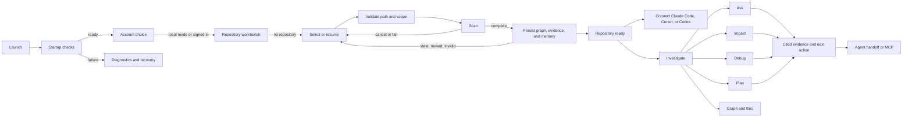

# Workflow map

## Fragile handoffs

- Account/local-mode state controls protected repository and analysis routes.
- Scan completion populates `STATE.summary`, graph, recents, persistence state, and target pickers.
- Home agent cards depend on exact MCP IDs and real config-write/test handlers.
- Ask/Impact/Debug/Plan share DOM targets, history, and cross-navigation.
- Map selection feeds module inspection, Ask context, Impact, and copied paths.
- Diagnostics rebuild/cache actions mutate local state and require explicit explanation and confirmation.
