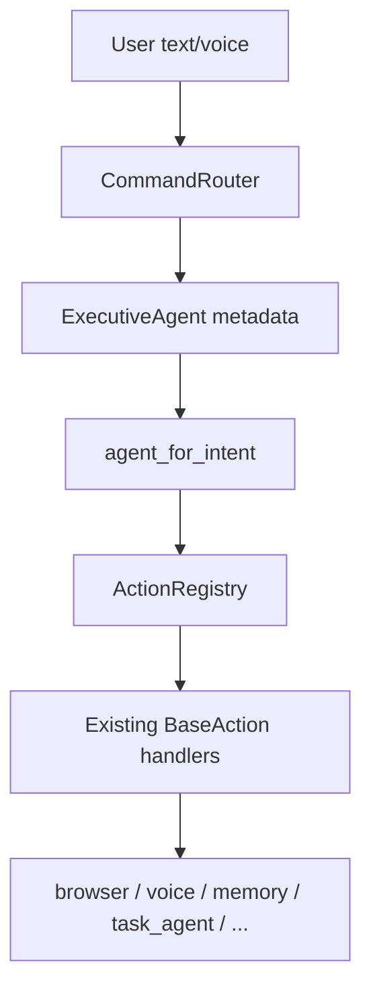

# Agent Architecture Report (Phase 70)

Formalizes existing JARVIS runtimes into seven agents. **No new capabilities, commands, or UI** — facades and routing metadata only. All commands still flow through `CommandRouter` → `ActionRegistry` unchanged.

## Architecture overview



| Agent | Role | Primary runtime ownership |
|-------|------|-------------------------|
| **Executive** | Classify, select agent, delegate, aggregate | `brain/router.py`, `brain/intent_classifier.py`, `actions/registry.py` |
| **Conversation** | Voice, STT, TTS, context | `voice/*`, `conversation/*`, `assistant/conversation_state.py` |
| **Memory** | Store, retrieve, rank, repair | `memory/*`, `brain/aliases.py`, `actions/memory_actions.py` |
| **Operator** | Browser, desktop, apps | `browser/runtime.py`, `desktop/*`, `apps/*`, `websites/*` |
| **Research** | Search, compare, summarize | `phase45_investigation.py`, `investigation/*`, `browser/runtime.py` (research) |
| **Coding** | Analysis, debug, patches | `task_agent/*`, `actions/code_search.py`, `actions/task_actions.py` |
| **Planning** | Tasks, goals, schedules | `task_agent/planner.py`, `workflows/*`, `assistant/plan_rules.py` |

## Current capability ownership

### Executive Agent (`agents/executive_agent.py`)

- Receives classified `CommandRequest` via `classify()` / `CommandRouter.route()`
- Selects owning agent via `agents/intent_routing.py` → `agent_for_intent()`
- Delegates through `ActionRegistry.execute()` (same as production)
- Aggregates multi-step results via `aggregate()`
- Owns meta/system intents: `unknown`, `clarify`, `show_capabilities`, health reports, alpha setup

### Conversation Agent (`agents/conversation_agent.py`)

| Capability | Runtime |
|------------|---------|
| Push-to-talk / voice loop | `voice/voice_loop.py` |
| Wakeword | `voice/wakeword_loop.py` |
| STT | `voice/transcriber.py`, `voice/streaming_stt/` |
| TTS | `voice/tts.py`, `voice/pyttsx3_completion.py` |
| Real voice test | `voice/real_voice_conversation.py` |
| Context turns | `conversation/context_store.py` |
| Human session | `conversation/human_runtime.py` |

### Memory Agent (`agents/memory_agent.py`)

| Capability | Runtime |
|------------|---------|
| Personal memory CRUD | `memory/store.py` |
| Keyword search | `memory/search.py` |
| Semantic search | `memory/semantic_runtime.py` |
| Graph | `memory/graph.py` |
| Repair | `memory/repair.py` |
| Project index | `memory/project_indexer.py` |
| Preferences/aliases | `brain/preferences.py`, `brain/aliases.py` |

### Operator Agent (`agents/operator_agent.py`)

| Capability | Runtime |
|------------|---------|
| Browser open/nav/search | `browser/runtime.py` |
| Browser agent loop | `browser/task_planner.py` |
| Desktop capture/OCR | `desktop/vision_runtime.py`, `desktop/ocr_pipeline.py` |
| Desktop control | `desktop/control_runtime.py` |
| App launch | `apps/launcher.py`, `actions/app_actions.py` |
| Websites | `websites/launcher.py` |
| Screen understanding | `vision/screen_understanding.py` |

### Research Agent (`agents/research_agent.py`)

| Capability | Runtime |
|------------|---------|
| Project inspection | `phase45_investigation.py` |
| Live vs backtest | `phase45_investigation.py`, `investigation/*` |
| Browser summarize/compare | `browser/runtime.py` |
| Inbox/calendar summaries | `providers/daily_summary_provider.py` |
| Investigation graph | `assistant/investigation_graph.py` |
| Deep review | `task_agent/trading_deep_review.py` |

### Coding Agent (`agents/coding_agent.py`)

| Capability | Runtime |
|------------|---------|
| Supervised task session | `task_agent/` |
| Code search | `actions/code_search.py` |
| Patch propose/apply | `actions/task_actions.py`, `investigation/patch_simulation.py` |
| Error explain | `actions/productivity_actions.py`, `phase45_investigation.py` |

### Planning Agent (`agents/planning_agent.py`)

| Capability | Runtime |
|------------|---------|
| Task plans | `task_agent/planner.py` |
| Task queue | `task_agent/queue.py` |
| Experiments | `task_agent/experiment_planner.py` |
| Workflows | `workflows/registry.py`, `workflows/runner.py` |
| Assistant plan | `actions/assistant_actions.py` |
| Scheduler / proactive | `assistant/investigation_scheduler.py`, `assistant/proactive_assistant.py` |

## Agent boundaries

| Boundary | Rule |
|----------|------|
| **Execution** | Only `ActionRegistry` executes intents; agents do not bypass registry |
| **Classification** | `brain/intent_classifier.py` remains single source of intent labels |
| **Security** | `core/security.py`, `core/confirmation.py`, `alpha/safety.py` stay in router pipeline |
| **Operator vs Research** | Browser *actions* → Operator; investigation/summarize-inbox → Research |
| **Coding vs Planning** | Patch/inspect/debug → Coding; task plan/queue/workflow → Planning |
| **Executive fallback** | Unmapped intents default to Executive agent metadata |

## Cross-agent dependencies

| From | To | Dependency |
|------|-----|------------|
| Executive | All | Delegates via `ActionRegistry` to domain actions |
| Conversation | Executive | Voice input classified before routing |
| Operator | Memory | `browser/memory.py`, `desktop/memory.py` session hints |
| Research | Operator | Browser runtime for page research |
| Research | Memory | Investigation graph stored in memory layers |
| Coding | Planning | `task_agent` uses plans before execute steps |
| Planning | Coding | Workflow steps invoke coding intents |
| All | Executive | Router `_finalize()` logs history, session, audit |

**Shared infrastructure (not owned by a single agent):**

- `config.py` / `.env` flags
- `data/` persistence
- `reliability/*_health.py` diagnostics
- `validation/` strict graders (Phase 66+)

## Future expansion points

1. **Router hook** — Optional `ExecutiveAgent.select_agent()` log in `CommandRouter._process` without changing execution path.
2. **Per-agent registries** — Split `ActionRegistry._register_defaults()` into domain sub-registers loaded by agent.
3. **Agent-local state** — Move `browser/memory.py`, `desktop/memory.py` under agent packages.
4. **Multi-agent plans** — `ExecutiveAgent.aggregate()` driving explicit multi-step workflows (browser → memory → summarize).
5. **Agent health** — Extend `show system health` with per-agent readiness from facades.
6. **External SDK** — Expose `get_executive_agent().route_text()` for headless integrations.

## Regression guarantee

| Check | Status |
|-------|--------|
| `CommandRouter.route()` unchanged | Yes — no router edits |
| `ActionRegistry` unchanged | Yes |
| New commands | None |
| New UI | None |
| Smoke test | `scripts/smoke_phase70_agent_architecture.py` |

## File map

```
agents/
  __init__.py
  base.py                 # AgentId, AgentCapability, AgentDelegation
  intent_routing.py       # intent → agent
  executive_agent.py
  conversation_agent.py
  memory_agent.py
  operator_agent.py
  research_agent.py
  coding_agent.py
  planning_agent.py
```

## Usage (internal)

```python
from agents import get_executive_agent, agent_for_intent
from core.types import Intent

exec_agent = get_executive_agent()
owner = agent_for_intent(Intent.REMEMBER_FACT)  # AgentId.MEMORY
result = exec_agent.route_text("remember that meeting is at 3pm")  # same as CommandRouter
```
