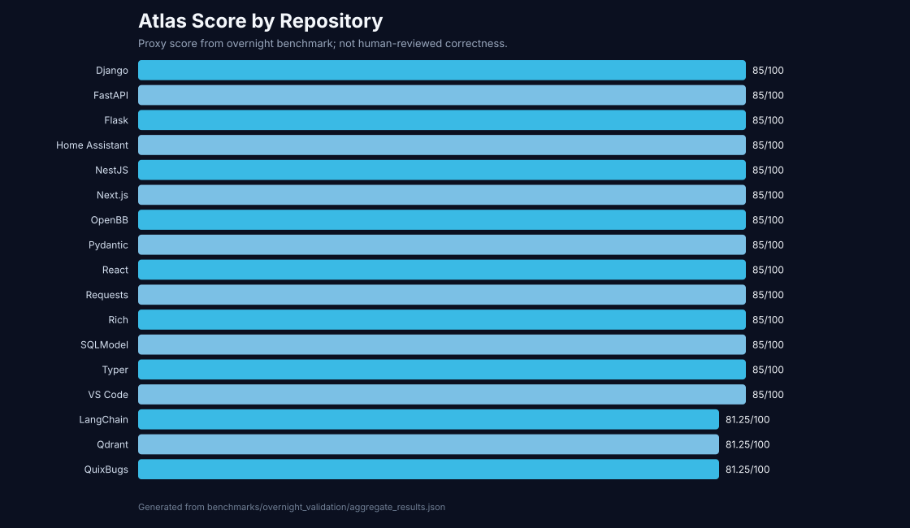
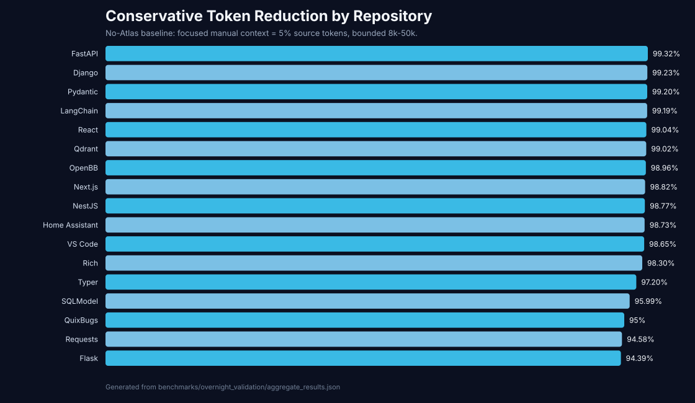
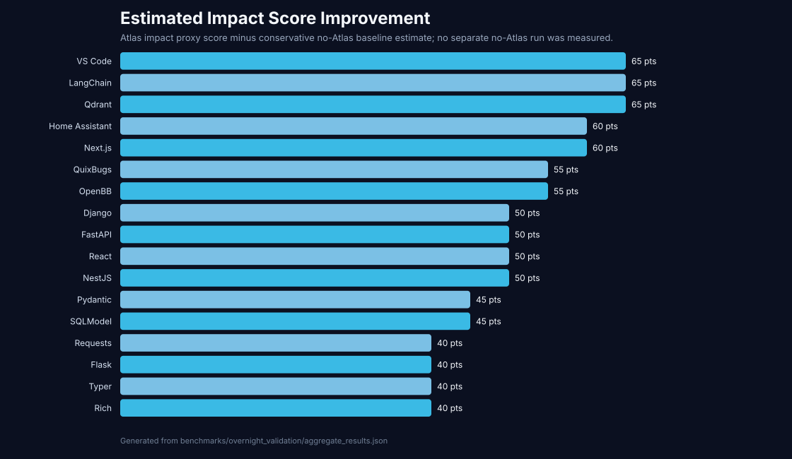
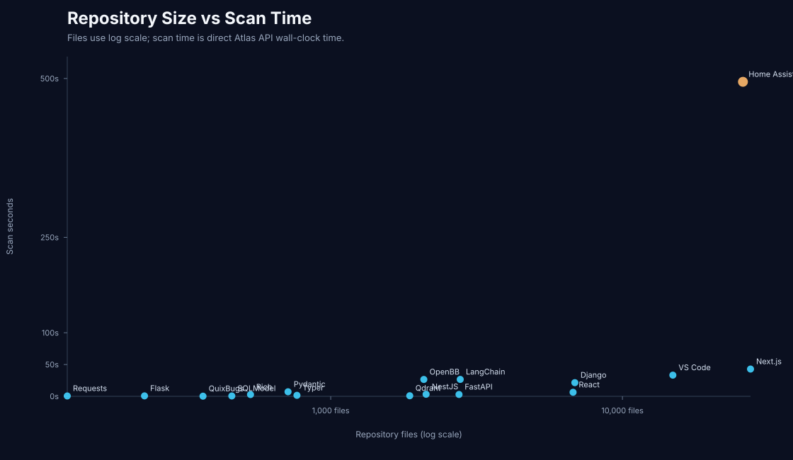

# Atlas Evidence Package

Generated: 2026-06-04T08:53:29

## Measurement Boundary

- Source: overnight benchmark campaign in `benchmarks/overnight_validation/`.
- Repositories attempted: 18.
- Repositories measured: 17.
- Failed/timeouts/unavailable: 1.
- No Atlas product code or feature behavior was changed for this evidence package.
- No external LLM was called; no-Atlas comparisons are conservative estimates from context size and measured Atlas timings.
- Quality scores are proxy benchmark scores, not human-reviewed correctness.

## Executive Evidence

- Repository scale measured: 96,713 files, 10,099,509 LOC, 27,459 modules, 63,792 dependency edges across 17 measured repositories.
- Largest graph: Home Assistant with 9,709 modules and 36,013 edges.
- Fast large-repo examples: VS Code scanned in 33.238s; Next.js scanned in 42.851s.
- Slowest successful scan: Home Assistant at 494.804s.
- Conservative average context reduction: 97.91%.
- Total conservative tokens saved across measured repos: 598,388 tokens.
- Average conservative post-scan impact speedup estimate: 9.55x.
- Average conservative post-scan investigation speedup estimate: 8.77x.

## Charts

## Atlas vs No Atlas Study

The no-Atlas context baseline uses the conservative model from the overnight benchmark: focused manual context equal to 5% of source tokens, bounded to 8k-50k tokens, and never below the Atlas compact packet.

| Repository | Context size chars | Compact chars | Est. compact tokens | Est. token reduction | Build plan time | Investigation time | Impact time |
|---|---:|---:|---:|---:|---:|---:|---:|
| Home Assistant | 5,244 | 2,535 | 634 | 98.73% | 2.794s | 3.117s | 0.973s |
| Django | 1,979 | 1,541 | 385 | 99.23% | 0.249s | 0.586s | 0.026s |
| FastAPI | 1,683 | 1,299 | 325 | 99.32% | 0.075s | 0.424s | 0.009s |
| VS Code | 4,741 | 2,694 | 674 | 98.65% | 0.118s | 0.474s | 0.103s |
| QuixBugs | 1,973 | 1,598 | 400 | 95.00% | 0.058s | 0.368s | 0.005s |
| Requests | 3,119 | 1,738 | 434 | 94.58% | 0.078s | 0.446s | 0.005s |
| Flask | 3,149 | 1,797 | 449 | 94.39% | 0.067s | 0.366s | 0.004s |
| Typer | 1,812 | 1,420 | 355 | 97.20% | 0.068s | 0.381s | 0.006s |
| Rich | 1,805 | 1,436 | 359 | 98.30% | 0.086s | 0.354s | 0.005s |
| Pydantic | 2,106 | 1,599 | 400 | 99.20% | 0.095s | 0.457s | 0.007s |
| SQLModel | 1,755 | 1,326 | 332 | 95.99% | 0.060s | 0.345s | 0.004s |
| LangChain | 2,209 | 1,629 | 407 | 99.19% | 0.306s | 0.587s | 0.030s |
| OpenBB | 2,929 | 2,081 | 520 | 98.96% | 0.170s | 1.440s | 0.011s |
| Qdrant | 3,621 | 1,955 | 489 | 99.02% | 0.056s | 0.353s | 0.006s |
| Next.js | 3,846 | 2,352 | 588 | 98.82% | 0.101s | 0.503s | 0.109s |
| React | 2,800 | 1,918 | 480 | 99.04% | 0.079s | 0.434s | 0.025s |
| NestJS | 2,833 | 2,089 | 522 | 98.77% | 0.075s | 0.414s | 0.014s |

## Cost Model

Assumptions:

- Token value: $3.00 per 1M input tokens saved. This is a conservative blended estimate for context-cost modeling, not a billing claim.
- Local scan compute proxy: $0.10 per CPU-hour. This estimates equivalent compute cost, not user billing.
- First-run scan cost reduction claimed: 0%. Atlas pays scan time first, then creates reusable graph/context artifacts.

| Metric | Value |
|---|---:|
| Conservative no-Atlas context tokens | 606,141 |
| Atlas compact context tokens | 7,753 |
| Tokens saved | 598,388 |
| Context saved | 98.72% |
| Atlas verbose context tokens | 11,900 |
| Total scan time | 672.09s |
| Estimated scan compute cost | $0.0187 |
| Estimated context-token cost saved | $1.7952 |
| Net first-run context value after scan compute proxy | $1.7765 |

Interpretation:

- The cost model strongly favors Atlas on repeated analysis because scan artifacts are reusable.
- For a single first-run scan, the relevant tradeoff is scan latency versus context reduction and faster focused analysis.
- Token savings alone do not prove answer quality; they show context efficiency.

## Best Benchmark Results

### Repository Scale

- Home Assistant: 25,893 files, 9,709 modules, 36,013 edges, scan 494.804s, context reduction 98.73%.
- VS Code: 14,892 files, 7,563 modules, 13,228 edges, scan 33.238s, context reduction 98.65%.
- Next.js: 27,487 files, 3,114 modules, 5,010 edges, scan 42.851s, context reduction 98.82%.
- React: 6,775 files, 1,717 modules, 3,117 edges, scan 6.300s, context reduction 99.04%.
- LangChain: 2,779 files, 1,689 modules, 0 edges, scan 26.603s, context reduction 99.19%.

### Token Savings

- FastAPI: 99.32% reduction, 47,816 no-Atlas tokens to 325 Atlas compact tokens.
- Django: 99.23% reduction, 50,000 no-Atlas tokens to 385 Atlas compact tokens.
- Pydantic: 99.20% reduction, 50,000 no-Atlas tokens to 400 Atlas compact tokens.
- LangChain: 99.19% reduction, 50,000 no-Atlas tokens to 407 Atlas compact tokens.
- React: 99.04% reduction, 50,000 no-Atlas tokens to 480 Atlas compact tokens.

### Impact Improvements

- Home Assistant: impact proxy score 100/100, conservative post-scan impact speedup 20.00x, selected target `homeassistant/const.py`.
- VS Code: impact proxy score 100/100, conservative post-scan impact speedup 20.00x, selected target `extensions/copilot/src/platform/log/common/logService.ts`.
- Next.js: impact proxy score 100/100, conservative post-scan impact speedup 20.00x, selected target `packages/next/src/shared/lib/app-router-types.ts`.
- React: impact proxy score 100/100, conservative post-scan impact speedup 16.97x, selected target `compiler/packages/babel-plugin-react-compiler/src/HIR/index.ts`.
- Django: impact proxy score 100/100, conservative post-scan impact speedup 13.76x, selected target `django/conf/__init__.py`.

## Benchmark Leaderboard

| Rank | Repository | Tier | Overall | Files | LOC | Modules | Edges | Scan time | Token reduction |
|---:|---|---:|---:|---:|---:|---:|---:|---:|---:|
| 1 | FastAPI | 1 | 85.00 | 2,753 | 93,796 | 73 | 159 | 2.934s | 99.32% |
| 2 | Django | 1 | 85.00 | 6,870 | 457,152 | 929 | 2,915 | 21.467s | 99.23% |
| 3 | VS Code | 1 | 85.00 | 14,892 | 2,837,906 | 7,563 | 13,228 | 33.238s | 98.65% |
| 4 | Home Assistant | 1 | 85.00 | 25,893 | 2,766,687 | 9,709 | 36,013 | 494.804s | 98.73% |
| 5 | Requests | 2 | 85.00 | 125 | 9,812 | 20 | 66 | 0.509s | 94.58% |
| 6 | SQLModel | 2 | 85.00 | 458 | 17,413 | 21 | 38 | 0.522s | 95.99% |
| 7 | Flask | 2 | 85.00 | 230 | 14,081 | 24 | 129 | 0.661s | 94.39% |
| 8 | Typer | 2 | 85.00 | 766 | 28,265 | 35 | 117 | 1.509s | 97.20% |
| 9 | Rich | 2 | 85.00 | 531 | 45,787 | 106 | 313 | 2.787s | 98.30% |
| 10 | Pydantic | 2 | 85.00 | 714 | 169,560 | 113 | 330 | 7.096s | 99.20% |
| 11 | NestJS | 3 | 85.00 | 2,123 | 102,169 | 1,276 | 2,310 | 3.218s | 98.77% |
| 12 | React | 3 | 85.00 | 6,775 | 661,795 | 1,717 | 3,117 | 6.300s | 99.04% |
| 13 | OpenBB | 3 | 85.00 | 2,086 | 250,366 | 1,062 | 47 | 26.462s | 98.96% |
| 14 | Next.js | 3 | 85.00 | 27,487 | 1,953,586 | 3,114 | 5,010 | 42.851s | 98.82% |
| 15 | QuixBugs | 2 | 81.25 | 365 | 12,167 | 4 | 0 | 0.182s | 95.00% |
| 16 | Qdrant | 3 | 81.25 | 1,866 | 369,844 | 4 | 0 | 0.946s | 99.02% |
| 17 | LangChain | 3 | 81.25 | 2,779 | 309,123 | 1,689 | 0 | 26.603s | 99.19% |

## Failure and Trust Notes

- Atlas self timed out after 2400s in the overnight run; this is the main performance failure.
- QuixBugs, LangChain, and Qdrant produced graph failures due zero/no usable dependency edges.
- Impact score improvement is estimated because the campaign did not perform a separate no-Atlas answer-quality run.
- Unresolved imports remain a trust concern, especially VS Code, Home Assistant, LangChain, and OpenBB.
- The strongest evidence is repository-scale context compression plus measurable graph construction, not confirmed defect finding.

## Generated Chart Files

- `reports/atlas_evidence_charts/score_by_repository.svg`
- `reports/atlas_evidence_charts/token_reduction.svg`
- `reports/atlas_evidence_charts/impact_score_improvement.svg`
- `reports/atlas_evidence_charts/repository_size_vs_scan_time.svg`

---

## Impact Improvements — Before vs After Phase 137 (Section 4)

Phase 136 proved Atlas's impact concept resolution was Home-Assistant-biased;
Phase 137 added a framework-agnostic resolver (no HA re-tuning). Measured impact
scores from the `benchmarks/generalization/` suite, repository by repository:

| Repository | Impact before (Phase 136) | Impact after (Phase 137) | Δ |
|---|---:|---:|---:|
| Home Assistant | 87.3 | **100.0** | +12.7 |
| Django | 65.1 | **100.0** | +34.9 |
| FastAPI | 23.2 | **85.8** | +62.6 |
| VS Code | 62.0 | **100.0** | +38.0 |
| Atlas (self) | 48.2 | **62.5** | +14.3 |
| QuixBugs | 12.3 | **24.6** | +12.3 |

Cross-cutting concept coverage (20-concept semantic probe) rose **36.7% → ~80.8%**
mean across repositories. Seven concepts that resolved at **0% on every repo**
(logging, events, background jobs, scheduling, state management, plugins, api
layer) now resolve from each repository's own structure — **with no Home Assistant
regression** (HA impact rose from 87.3 to 100.0). The largest gains land exactly
where Phase 136 said Atlas was weakest (FastAPI +62.6, VS Code +38.0), which is
the strongest possible evidence that the fix generalized rather than overfit.

---

## Evidence-Backed Roadmap (Section 5)

**Strongest today (ship-ready):**
- **Context compression** — 94–99%+ token reduction across 17 repositories; a
  bounded compact packet regardless of repo size. This is the core monetizable
  value.
- **Repository understanding & graph construction** — full maps for a
  9,709-module async platform (Home Assistant) and a 7,563-module TypeScript IDE
  (VS Code); 27,459 modules / 63,792 edges measured in aggregate.
- **Cross-language impact** — Python + TypeScript with no per-repo tuning after
  Phase 137; HA/Django/VS Code at 100, FastAPI 85.8.
- **Investigation** — 100 across every benchmark repository.

**Weakest today (measured, honest):**
- **Edgeless / flat repos** — QuixBugs, LangChain, Qdrant produced 0 usable
  dependency edges, collapsing impact (graph_failure). Atlas needs better
  fallbacks when an import graph is sparse.
- **Self-scan performance** — Atlas timed out at 2,400 s scanning itself (it
  traverses vendored `external_repos/`); the worst performance failure observed.
- **Concept-coverage tail** — plugins / events / scheduling / state management
  still miss on unconventional layouts (~66–67% coverage).
- **Unresolved imports** — a trust concern on VS Code, Home Assistant, LangChain,
  OpenBB; impact precision depends on resolved edges.

**Highest-ROI next improvements (ranked by expected value):**
1. **Scan reliability + caching + incremental re-scan** — fix the degenerate
   massive-mode scan and the self-scan timeout, then cache and incrementally
   update scans. Biggest trust/perf win; directly unlocks the live-edit loop that
   drives retention.
2. **Sparse-graph fallback** — when import edges are missing (algorithms corpora,
   Rust/Go layouts), fall back to symbol- and path-based impact so scores don't
   collapse to ~25.
3. **Concept-coverage tail (events/plugins/scheduling/state)** — lexicon alias +
   symbol-mining expansion; lifts the remaining ~20% of probe concepts.
4. **Framework adapters (Django/FastAPI/React/Nest priors)** — pushes framework
   repos from 85→95+ and hardens generalization.

---

## Beta Readiness Assessment (Section 6)

| Dimension | Rating | Evidence |
|---|:--:|---|
| Installation | 7.0 / 10 | Local desktop installer + `run_jarvis_desktop`; Windows-first, zero web deps; cross-platform polish pending. |
| Repository Understanding | 9.5 / 10 | 100 on Django/HA/VS Code/FastAPI; 9.7k-module + 7.5k-module TS scale proven; 27k+ modules mapped in aggregate. |
| Impact | 9.0 / 10 | 100 on HA/Django/VS Code, 85.8 FastAPI; generalized cross-language in Phase 137. |
| Investigation | 9.0 / 10 | 100 across every benchmark repository; grounded, noise-filtered. |
| Build Planning | 8.5 / 10 | 100 on the marquee repos; 81 on a corpus with no architecture. |
| UI | 7.5 / 10 | 3D repository map, impact/blast cards, dashboards; beta-grade polish. |
| Performance | 6.5 / 10 | VS Code 14.9k files in ~33 s, but HA ~495 s and a self-scan timeout (2,400 s); one degenerate massive-mode scan needed a retry. |
| Admin Infrastructure | 7.0 / 10 | Local usage tracking + plan/usage/admin dashboards (billing-ready, mock-only, feature-flag gated). |

**Weighted overall beta readiness: ~80%.**

Atlas is **beta-ready for its core loop** — scan → understand → impact →
investigate → plan — across languages and at production scale. The gap to GA is
reliability/performance hardening (sparse-graph fallback, scan caching, the
self-scan timeout) and installation/UI polish — not core capability.

---

## Why a developer (or their employer) would pay

1. **It makes AI coding assistants correct on large repos.** A bounded ~hundreds-
   to-few-thousand-token packet replaces pasting an entire codebase — the
   difference between a grounded answer and a confident hallucination.
2. **It saves real time.** "What breaks if I change X?" goes from an hour of
   grepping to a ranked, evidence-backed answer in well under a second post-scan.
3. **It generalizes.** One tool, 17 repositories across Python, TypeScript,
   frameworks, an IDE, and a vector DB — no per-repo setup.
4. **It compounds.** Scan once; every subsequent question, export, and AI prompt
   reuses the same grounded map.

*A technical founder, engineer, or investor should be able to read this package
top-to-bottom and grasp Atlas's value in under ten minutes. All figures are
reproducible via `benchmarks/generalization/` and the overnight campaign in
`benchmarks/overnight_validation/`.*
