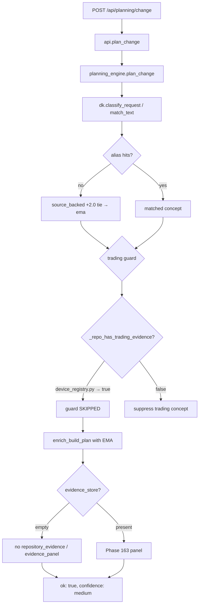

# Phase 164-DIAG-CURSOR — Code Path Trace Audit

Date: 2026-06-05  
Scope: **read-only forensic trace**. No production code was modified. No commits.

Source inputs: Phase 161B failure forensics (`reports/phase161b_failure_forensics.md`), Phase 158/161 guardrail code, live Python reproductions against synthetic contexts.

---

## Executive summary

Atlas has **two parallel trust stacks**:

| Stack | Routes | Phase 158/161 guardrails |
|-------|--------|--------------------------|
| **Modern** | `POST /api/planning/{change,investigate,impact}` → `planning_engine` / `impact_engine` | Partially applied |
| **Legacy** | `POST /api/impact`, `POST /api/bug-investigation`, parts of Copilot | Weak or absent |

The dominant Phase 161B integration failure (EMA/trading leakage on unrelated prompts) is **not** a missing Phase 158 function — it is a **wiring and threshold bug chain**:

1. `atlas_knowledge.engine.match_text()` returns **EMA** for unrelated prompts when **no alias matches**, because `source_backed` concepts all receive `+2.0` quality boost and EMA wins the tie-break.
2. `_TRADING_REPO_PATH_SIGNALS` includes `"registry.py"` as a substring — Home Assistant / Django repos with `device_registry.py` falsely pass `_repo_has_trading_evidence()`.
3. Build trading guard (`plan_change` L1175–1187) only suppresses when **both** user intent and repo evidence are absent — false-positive repo evidence bypasses it.
4. Investigation coercion (`_coerce_investigation_classification`) uses the same repo gate — same bypass.
5. `evidence_store` is often empty in live context → `repository_evidence` / `evidence_panel` stay null → UI/export show path-only plans **without** symbol evidence (Phase 163 fields never surface).

Phase 158 **did** land for impact target-not-found (`ok=false`, `status=target_not_resolved`). Phase 161B scored 11 Kubernetes WRONG rows that are **audit bugs**, not fake success.

---

## 1. Output field producers

### 1.1 HTTP entrypoints (`jarvis_desktop/server.py`)

| Route | Handler | Core function | Primary `ok` source |
|-------|---------|---------------|---------------------|
| `POST /api/planning/change` | `_planning_change` | `api.plan_change` → `planning_engine.plan_change` | `plan_change` L1396 |
| `POST /api/planning/investigate` | `_planning_investigate` | `api.investigate_symptom` → `planning_engine.investigate_symptom` | `investigate_symptom` L1883 |
| `POST /api/planning/impact` | `_planning_impact` | `api.change_impact_simulation` → `impact_engine.analyze_impact` | `engine.py` L479 |
| `POST /api/impact` | lambda | `api.impact` (legacy) | `api.py` L2478 / L2501 |
| `POST /api/bug-investigation` | lambda | `api.bug_investigation` | `api.py` L2677 |
| `POST /api/copilot/ask` | `_copilot` | `api.copilot_ask` | `_copilot_envelope` L3186 |
| `POST /api/context/export` | lambda | `api.context_export` | `api.py` L2704 |
| `POST /api/demo/export-bundle` | lambda | `api.export_demo_bundle` | `api.py` L2841 |

Desktop UI (`static/app.js`) uses **`/api/planning/impact`** only — not legacy `/api/impact`.

### 1.2 `ok` / `status` / `confidence` / `mock` / `root_cause`

| Field | Build plan | Investigation | Impact (modern) | Impact (legacy) | Copilot |
|-------|------------|---------------|-----------------|-----------------|---------|
| `ok` | `plan_change` return | `investigate_symptom` return | `analyze_impact` | `api.impact` | `_copilot_envelope` default `True` |
| `status` | — | — | `resolved` / `target_not_resolved` / `no_graph` | `target_not_resolved` on miss only | `mode` string, not `status` |
| `confidence` | `_confidence_label` + `calibrate_confidence_cap` | same + explicit-path boost | import-count heuristic + cap | **not set on success** | often `"high"` default in envelope |
| `mock` | — | — | absent (Phase 161 removed fake mock) | `False` on miss | — |
| `root_cause` | — | `most_likely_root_cause` | — | — | — |
| `evidence_count` | **not exposed** (internal to `calibrate_confidence_cap`) | **not exposed** | uses `resolved_signal` internally | — | — |
| `evidence_panel` | Phase 163 if `evidence_store` present | same | Phase 163 if store present | — | partial via `evidence` list |

### 1.3 `insufficient_evidence` / unknown mode

| Function | File | Returns `ok`? | When |
|----------|------|---------------|------|
| `_insufficient_evidence_response` | `planning_engine.py` L1116–1144 | **`ok: True`** + `insufficient_evidence: True` | `unsupported_language_limited` + no matched modules (build L1266, investigate L1715) |
| `analyze_impact` no graph | `impact_engine/engine.py` L220–233 | `ok: False`, `status: no_graph` | empty graph |
| `analyze_impact` unresolved | `impact_engine/engine.py` L269–292 | `ok: False`, `status: target_not_resolved` | target not in graph |
| `_impact_mock` | `api.py` L2496–2515 | `ok: False`, `mock: False` | legacy impact miss |
| `_answer_unknown` (copilot) | `api.py` L3648–3665 | `ok: True`, `confidence: low` | unrouted question |

**Auditor trap:** `_insufficient_evidence_response` intentionally returns `ok=true` so the UI can render a gap card — but batch runners that only check top-level `ok` count it as success.

---

## 2. Legacy / mock / fallback path inventory

| Pattern | Location | Behavior | Phase 158/161? | Tests |
|---------|----------|----------|----------------|-------|
| `_impact_mock` | `api.py` L2496–2515 | `ok=False`, `status=target_not_resolved`, `mock=False` | **Yes** — honest refusal | `test_phase161_unknown_mode.py::test_legacy_impact_mock_is_not_success`, `test_phase107` |
| `api.impact` (legacy) | `api.py` L2453–2493 | On hit: `ok=True`, direct importers only, **no** `confidence`, `status`, `graph_health` | **Bypasses** impact_engine caps | `test_phase107::test_impact_real_and_mock` |
| `POST /api/impact` route | `server.py` L117, L439 | Still wired to legacy `api.impact` | Bypass | `test_phase107` dispatch only |
| `bug_investigation` | `api.py` L2655–2686 | `ok=True` always; `mock=not bool(paths)`; `confidence="high"` if path in blob | **No** calibration | `test_phase107::test_bug_investigation_shape` (happy path only) |
| `_copilot_envelope` default | `api.py` L3170–3202 | `confidence="high"` unless caller overrides | **No** graph/evidence cap | `test_phase119` checks presence, not calibration |
| `match_text` tie default | `atlas_knowledge/engine.py` L120–151 | No alias hit → `source_backed` concepts tie at 2.0 → first high-rank wins (often `ema`) | **Bypasses** trading guards downstream | Partial: `test_phase158_no_leakage` (synthetic web paths, not HA) |
| `_repo_has_trading_evidence` | `planning_engine.py` L617–629 | `"registry.py"` substring in **any** path | **False positive** on HA/Django | `test_phase158_no_leakage::test_repo_has_trading_evidence_detection` (positive case only) |
| `apply_to_investigation_plan` | `evidence_builder.py` L337–343 | Overwrites `most_likely_root_cause` from `bundle.found[0]`; can set `confidence=high` from insertion_confidence | **Overrides** Phase 161 root-cause gate | No dedicated test |
| `simulate_change_impact` | `planning_engine.py` L2016–2078 | Dead code — **no callers** | N/A | None |
| `export_demo_bundle` | `api.py` L2784–2845 | `ok=True`; bundles summary/graph/context — **no** plan grounding fields | N/A | `test_phase112::test_export_demo_bundle` (shape only) |
| `zfChangePromptBody` / export | `atlas_zero_friction.js` L50–82 | Copies plan lists; **omits** `domain_knowledge`, `evidence_panel`, `evidence_reason` | N/A | `test_phase155` UX only |

### `confidence="high"` assignment hotspots (non-exhaustive)

| File | Region | Condition |
|------|--------|-----------|
| `impact_engine/engine.py` | L414–415 | `resolved_signal >= 3` |
| `planning_engine.py` | L1487, L1689 | explicit path in symptom / keyword match |
| `evidence_builder.py` | L340–341 | `insertion_confidence >= 60` overwrites investigation confidence |
| `api.py` | L2675, L3345+, L3416, L3549+ | copilot risk/dependency/cycles modes |
| `impact_engine/target_resolver.py` | L385 | semantic score thresholds |

---

## 3. Suspicious paths — catalog

### SP-01 — Default concept → EMA on zero alias match

- **File:** `jarvis_desktop/atlas_knowledge/engine.py`
- **Function:** `KnowledgeEngine.match_text` (L120–151)
- **Trigger:** Any prompt with no alias hits; `LOCAL_CONFIDENCE_THRESHOLD = 2.0`; `quality_confidence_boost(source_backed) = 2.0`
- **Effect:** `classify_request` → `concept_id=ema`, `domain=trading`
- **Bypasses Phase 158/161?** **Yes** — upstream of trading guards
- **Tests:** Synthetic web-path leakage tests exist; **no** test for zero-alias tie → EMA

### SP-02 — False-positive trading repo via `registry.py` substring

- **File:** `jarvis_desktop/planning_engine.py`
- **Function:** `_repo_has_trading_evidence` (L617–629), signal list L591–595
- **Trigger:** Any scanned path containing `registry.py` (e.g. `device_registry.py`)
- **Effect:** Trading guard in `plan_change` (L1178–1180) and `_coerce_investigation_classification` (L815–818) **does not suppress**
- **Bypasses Phase 158/161?** **Yes** — guard condition never fires
- **Tests:** `test_repo_has_trading_evidence_detection` proves true positive; **no** false-positive test for `device_registry.py`

### SP-03 — Build plan returns `ok=true` with wrong domain knowledge

- **File:** `jarvis_desktop/planning_engine.py` → `atlas_knowledge/engine.py` `enrich_build_plan` (L397+)
- **Chain:** `plan_change` → `dk.classify_request` → (failed guard) → `dk.enrich_build_plan`
- **Missing fields:** `repository_evidence`, `evidence_panel` when `evidence_store` empty
- **Bypasses Phase 158/161?** Partial — confidence capped to `medium` (3 modules) but **concept label wrong**
- **Tests:** `test_phase161_grounding` (synthetic `_WEB_PATHS`, not HA registry false positive)

### SP-04 — Investigation root cause overwritten by evidence bundle

- **File:** `jarvis_desktop/evidence_engine/evidence_builder.py`
- **Function:** `apply_to_investigation_plan` (L327–346)
- **Trigger:** `bundle.found` non-empty after `analyze_investigation`
- **Effect:** Replaces `most_likely_root_cause` set by Phase 161 grounded-hypothesis logic; may bump `confidence` to `high`
- **Bypasses Phase 158/161?** **Yes** — runs after `investigate_symptom` hypothesis pruning
- **Tests:** None for overwrite behavior

### SP-05 — Dual impact APIs

- **Modern:** `change_impact_simulation` → `impact_engine.analyze_impact` — full caps, `status`, Phase 163 panel
- **Legacy:** `api.impact` — graph-only direct importers; success payload lacks `confidence`, `graph_health`, `evidence_panel`
- **Route:** `POST /api/impact` still public (`server.py` L117)
- **Bypasses Phase 158/161?** Legacy path partially bypasses
- **Tests:** Legacy miss path tested; legacy **success** shape not compared to modern

### SP-06 — Copilot `confidence="high"` without evidence calibration

- **File:** `jarvis_desktop/api.py`
- **Functions:** `_copilot_envelope` (default L3179), `_answer_risk` (L3416), `_answer_dependency` (L3616), `_answer_cycles` (L3549)
- **Trigger:** Risk / dependency / cycles modes on any scan
- **Effect:** `ok=true`, `confidence=high` with static graph evidence only
- **Bypasses Phase 158/161?** **Yes** — no `calibrate_confidence_cap`, no `evidence_panel`
- **Tests:** `test_phase119::test_copilot_has_confidence` — existence only

### SP-07 — Bug investigation `mock=true` with `ok=true`

- **File:** `jarvis_desktop/api.py` L2655–2686
- **Trigger:** No path token match in symptom text
- **Effect:** `ok=true`, `mock=true`, `confidence=low|medium`
- **Bypasses Phase 158/161?** **Yes** — separate route from `planning/investigate`
- **Tests:** Happy-path only in `test_phase107`

### SP-08 — Export / Send-to-AI strips trust fields

- **Files:** `static/atlas_zero_friction.js` (`zfChangePromptBody`, `zfInvestigatePromptBody`, `zfImpactPromptBody`)
- **Effect:** Exported markdown omits `domain_knowledge.concept_id`, `evidence_panel`, `evidence_reason`, `confidence_cap_reason`, `root_cause_evidence_score`
- **Bypasses Phase 158/161?** Presentation gap — user sees simplified prompt
- **Tests:** `test_phase155_first_user_experience` — panel exists, not field fidelity

### SP-09 — `evidence_count` not in API schema

- **Files:** `reliability.calibrate_confidence_cap`, `planning_engine.plan_change` / `investigate_symptom`
- **Effect:** Consumers cannot verify why confidence was capped
- **Tests:** `test_phase161_confidence` unit tests only; not on API payload contract

---

## 4. Five reproduced examples (Phase 161B-aligned)

### Example A — Build Plan integration bug (EMA leakage)

**161B row:** #1 — `add event bus tracing` / home_assistant / build

**Command:**
```python
from jarvis_desktop import planning_engine as pe
pe.plan_change("add event bus tracing", ha_ctx)  # synthetic HA graph, empty evidence_store
```

**Raw response (trimmed):**
```json
{
  "ok": true,
  "plan": {
    "confidence": "medium",
    "graph_health": "healthy",
    "domain_knowledge": {
      "applied": true,
      "concept_id": "ema",
      "concept_name": "EMA",
      "domain": "trading",
      "domain_label": "Trading Systems",
      "concept_confidence": "medium"
    },
    "implementation_files": [
      "homeassistant/helpers/event.py",
      "homeassistant/core.py",
      "homeassistant/helpers/device_registry.py"
    ],
    "evidence_panel": null,
    "repository_evidence": null
  }
}
```

**Expected trust fields:** `concept_id` should be non-trading or suppressed; `evidence_panel` / `repository_evidence` should explain file choice; `confidence` should be `low` without symbol evidence.

**Missing/wrong:** EMA/trading domain on non-trading prompt; no symbol evidence; `device_registry.py` in file list without "why".

**Exact code path:**
```
server._planning_change
  → api.plan_change (api.py:2530)
    → planning_engine.plan_change (planning_engine.py:1162)
      → dk.classify_request → match_text tie → ema (engine.py:120-151)
      → trading guard SKIPPED: _repo_has_trading_evidence true via device_registry.py (planning_engine.py:617-629, 1178-1180)
      → dk.enrich_build_plan (atlas_knowledge/engine.py:397+)
      → _repository_evidence_bundle returns None (no evidence_store)
      → return ok:true (planning_engine.py:1392-1397)
```

**Tests:** `test_phase158_no_leakage` — does not use HA registry paths; **gap**.

---

### Example B — Investigation integration bug (EMA + path root cause)

**161B row:** #2 — `why is event bus tracing broken` / home_assistant / investigation

**Command:**
```python
pe.investigate_symptom("why is event bus tracing broken", ha_ctx)
```

**Raw response (trimmed):**
```json
{
  "ok": true,
  "plan": {
    "most_likely_root_cause": "Defect originates in `homeassistant/helpers/event.py`",
    "root_cause_evidence_score": 60,
    "root_cause_threshold": 50,
    "confidence": "medium",
    "hypotheses": 3,
    "domain_knowledge": { "concept_id": "ema" }
  }
}
```

**Expected:** Non-trading concept; root cause should require symbol/graph evidence; `evidence_reason` on each hypothesis.

**Missing/wrong:** EMA domain knowledge; path-keyword root cause on `event.py` without symbol proof; `evidence_panel` null.

**Exact code path:**
```
api.investigate_symptom
  → planning_engine.investigate_symptom (planning_engine.py:1604)
    → dk.classify_request → ema (same SP-01)
    → _coerce_investigation_classification — NOT suppressed (repo registry false positive) (L783-833)
    → _build_hypotheses → path keyword scoring (L1392+)
    → grounded_hyps → most_likely_root_cause (L1756-1774)
    → _investigation_evidence_bundle may run; apply_to_investigation_plan can override root cause if bundle.found (evidence_builder.py:337-343)
    → return ok:true (L1883)
```

**Tests:** `test_phase161_grounding` — web paths; **no** HA + tracing scenario.

---

### Example C — Impact integration (resolved but thin evidence)

**161B row:** #12 — `impact of changing homeassistant/core.py`

**Command:**
```python
from jarvis_desktop.impact_engine.engine import analyze_impact
analyze_impact("homeassistant/core.py", ha_ctx)
```

**Raw response (trimmed):**
```json
{
  "ok": true,
  "status": "resolved",
  "confidence": "medium",
  "target": "homeassistant/core.py",
  "graph_health": "healthy",
  "evidence_panel": null
}
```

**Expected:** `evidence_panel` with symbol/call-graph support when `evidence_store` populated; relevance anchors for audit.

**Missing/wrong:** `evidence_panel` null (empty `evidence_store` in context); audit classified as MISLEADING for weak semantic relevance — **measurement**, not `ok=true` fake success.

**Exact code path:**
```
api.change_impact_simulation (api.py:2556)
  → impact_engine.analyze_impact (engine.py:216)
    → _find_target → resolved (engine.py:242+)
    → blast from import graph + Phase 134 enrichment
    → calibrate_confidence_cap (engine.py:424-435)
    → Phase 163 panel only if evidence_store.symbol_index (engine.py:513+)
    → return ok:true, status:resolved (engine.py:478-512)
```

**Tests:** `test_phase132_impact_and_quality`, `test_phase158_grounding_trust` — not 161B HA prompt set.

---

### Example D — Copilot route (uncalibrated high confidence)

**161B class:** C. Untested route / D. Integration

**Command:**
```python
api.load_demo_mode("small")
api.copilot_ask("What are the riskiest modules?")
```

**Raw response (trimmed):**
```json
{
  "ok": true,
  "mode": "risk",
  "confidence": "high",
  "risk_level": "high",
  "evidence": ["fan_in=...", "..."],
  "limitations": ["Ranking uses static import graph evidence; dynamic dispatch is not counted."]
}
```

**Expected:** `confidence` capped by scan health; `evidence_panel`-style structured evidence; no default `high`.

**Missing/wrong:** `_copilot_envelope(..., confidence="high")` hardcoded in `_answer_risk` (api.py:3416); no `graph_health`, no `confidence_cap_reason`.

**Exact code path:**
```
server._copilot → api.copilot_ask (api.py:3668)
  → classify_copilot_question → "risk" (api.py:3205)
  → _answer_risk (api.py:3378)
    → current_risks → ranked_modules
    → _copilot_envelope(confidence="high") (api.py:3404-3418)
```

**Tests:** `test_phase119::test_copilot_has_confidence` — does not assert cap; `test_phase134_2_copilot_impact_routing` — impact only.

---

### Example E — Export / demo path (success without grounding metadata)

**161B class:** Presentation / export gap

**Commands:**
```python
api.load_demo_mode("small")
api.context_export("claude", "compact")      # ok: true, estimated_tokens: 294
api.export_demo_bundle()                     # ok: true, zip with summary/graph/context
```

**Parallel UI path:** `copyForAi('claude','build')` → `zfChangePromptBody()` — omits `domain_knowledge`, `evidence_panel`, `implementation_files_with_why`.

**Expected trust fields in exported artifact:** concept id, evidence summary, confidence cap reason, graph health.

**Missing/wrong:** Bundle is scan-level only; Send-to-AI markdown is file-list oriented without "why selected" or symbol evidence.

**Exact code path:**
```
export_demo_bundle (api.py:2784)
  → current_summary + current_graph + context_export
  → ok:true zip (no plan/investigate/impact payloads)

copyForAi → composeAiPrompt → zfChangePromptBody (atlas_zero_friction.js:50-82)
  → uses STATE.buildResult.plan lists only
```

**Tests:** `test_export_demo_bundle` (zip shape); `test_phase155` (panel rendered); **no** export content audit.

---

## 5. Phase 161B Kubernetes impact rows (audit vs product)

**161B rows #66–76:** `ok: false`, `status: target_not_resolved` — **correct Phase 158 behavior**.

Reproduction (sparse k8s graph):
```python
analyze_impact("pkg/kubelet/kubelet.go", {
  "graph": {"nodes": [{"id":"m0","type":"module","path":"hack/verify-flags-underscore.py"}], "edges": []},
  "scan": {"file_count": 24860, "module_count": 3, "dependency_edges": 0},
})
# → ok: false, status: target_not_resolved (when graph has nodes but no match)
```

**Failure class E (audit bug):** Runner scored `ok=false` as WRONG / fake-success bucket because it used wrapper `ok` not `result.ok`.

---

## 6. Test coverage map (Phase 158/161 vs routes)

| Route / behavior | Covered? | Test files |
|------------------|----------|------------|
| Planning build/investigate leakage (synthetic web) | Partial | `test_phase158_no_leakage`, `test_phase161_grounding` |
| HA / registry false-positive trading evidence | **No** | — |
| Zero-alias EMA default concept | **No** | — |
| `apply_to_investigation_plan` root cause override | **No** | — |
| Modern impact `ok=false` unresolved | Yes | `test_phase158_grounding_trust`, `test_phase161_unknown_mode`, `test_phase132` |
| Legacy `api.impact` miss | Yes | `test_phase107`, `test_phase161_unknown_mode` |
| Legacy `api.impact` success shape vs modern | **No** | — |
| Copilot confidence calibration | **No** | — |
| `evidence_panel` in API when store empty | **No** | — |
| Export/Send-to-AI field fidelity | **No** | — |
| `insufficient_evidence` + `ok=true` contract | Yes | `test_phase158_grounding_trust`, `test_phase161_unknown_mode` |
| `bug_investigation` mock=true | **No** | — |

---

## 7. Suspected causes (no fixes — trace only)

| ID | Suspected cause | Severity | Routes affected |
|----|-----------------|----------|-----------------|
| C1 | `match_text` tie-break selects `ema` without alias hits | High | Build, Investigate |
| C2 | `registry.py` substring in `_TRADING_REPO_PATH_SIGNALS` | High | Build, Investigate guards |
| C3 | Trading guard requires **both** gates false; repo false positive opens trading | High | Build, Investigate |
| C4 | `evidence_store` often empty at plan time → no `evidence_panel` / `repository_evidence` | Medium | Build, Investigate, Impact |
| C5 | `apply_to_investigation_plan` overwrites Phase 161 root cause | Medium | Investigate |
| C6 | Legacy `POST /api/impact` still returns success without modern trust fields | Medium | Legacy API consumers |
| C7 | Copilot modes hardcode `confidence="high"` | Medium | Copilot |
| C8 | `bug_investigation` returns `ok=true` with `mock=true` | Low | Bug route |
| C9 | Export/Send-to-AI omits grounding metadata | Medium | UX export |
| C10 | `evidence_count` not exposed on API responses | Low | All planning outputs |
| C11 | Phase 161B audit used wrapper `ok` not nested `result.ok` | Audit | Measurement only |

---

## 8. Code-path diagram (Build Plan — EMA leakage)



---

## 9. Files touched by this audit (read-only)

- `jarvis_desktop/server.py` — route table
- `jarvis_desktop/api.py` — legacy impact, copilot, bug, export
- `jarvis_desktop/planning_engine.py` — build/investigate, guards, insufficient_evidence
- `jarvis_desktop/impact_engine/engine.py` — modern impact
- `jarvis_desktop/evidence_engine/evidence_builder.py` — investigation override
- `jarvis_desktop/atlas_knowledge/engine.py` — concept matching
- `jarvis_desktop/reliability.py` — confidence caps (internal evidence_count)
- `jarvis_desktop/static/atlas_zero_friction.js` — Send-to-AI export
- `reports/phase161b_failure_forensics.md` — failure taxonomy reference

---

## 10. Conclusion

Phase 158/161 guardrails **exist in code** but **do not uniformly govern live outputs**. The largest measurable gap in Phase 161B is **integration**: concept classification and repo-evidence gates misfire before planning logic runs, while evidence-heavy Phase 163 fields remain null without a populated `evidence_store`. Legacy routes (`/api/impact`, `/api/bug-investigation`, copilot risk/dependency) still emit `ok=true` with weak or uncalibrated confidence.

**No code changes were made in this phase.** This document is input for a follow-up fix phase.
