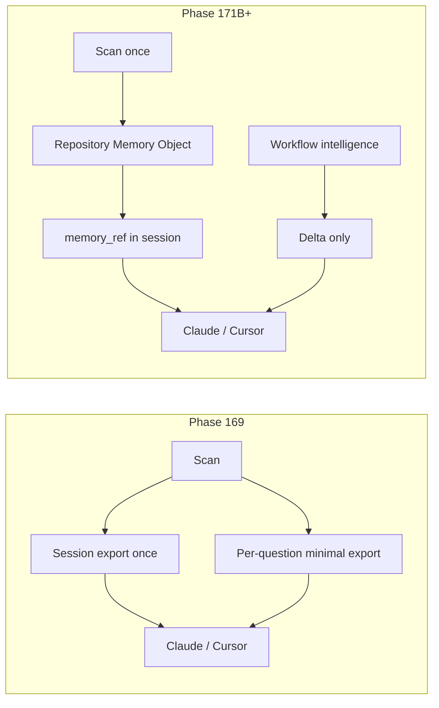

# Phase 171B — Next-Generation Atlas Architecture

**Date:** 2026-06-05

## Current vs target flow



## Component map

| Layer | Responsibility | New? |
| --- | --- | --- |
| Scan + index | Build graph, evidence store | existing |
| **Memory store** | Persist RMO keyed by `repo_signature` | **new** |
| **Version service** | Hash index/graph; bump major/minor | **new** |
| Planning / impact engines | Unchanged intelligence | existing |
| **Delta formatter** | Emit `ATLAS_DELTA v1` only | **new** |
| Export API | `memory` + `delta` endpoints replace `export.text` | extend |
| UI copy path | Pin memory once; copy deltas per question | extend |

## API sketch (no implementation)

```http
GET  /api/repositories/current/memory          → RMO v1 (once)
GET  /api/repositories/current/memory/version → {hash, version}
POST /api/planning/change                     → {delta, memory_ref, metrics}
POST /api/planning/investigate                → {delta, memory_ref, metrics}
POST /api/planning/impact                     → {delta, memory_ref, metrics}
```

## Cross-workflow memory sharing

One RMO serves Build, Investigate, Impact, and Understanding:

- **Shared:** graph, subsystems, hubs, risks, evidence index, confidence cap
- **Workflow-specific:** only in delta payload (never duplicated in memory)

## Client integration (Cursor / Claude)

1. **Session start:** paste or pin `ATLAS_REPOSITORY_MEMORY v1` once.
2. **Each question:** send only `ATLAS_DELTA v1` with `memory_ref`.
3. **Repo change detected:** Atlas returns `memory_stale: true`; client reloads RMO.

## Implementation phases (future)

| Phase | Scope |
| --- | --- |
| 171C | `memory_store` + version hash in `_STATE` |
| 171D | Delta formatters; API `delta` field on workflow responses |
| 171E | UI: pin memory panel + delta-only copy |
| 171F | Incremental invalidation on file watcher / git pull |

## Success metrics for implementation

- Per-question export tokens: **≤130** (from 364 today)
- 20Q session tokens: **≤3,000** for large repos (from ~8,000–10,000 today)
- Quality delta vs Phase 169 minimal: **≤ 0.2** (same bar as Phase 170)
- No trust regression on impact refusal paths

## Relation to prior phases

| Phase | Contribution |
| --- | --- |
| 168 | Identified A/B/C/D export categories |
| 169 | MINIMAL_EXPORT + ATLAS_SESSION v1 |
| 170 | Validated minimal quality parity |
| **171B** | **Memory + delta architecture (this doc)** |
